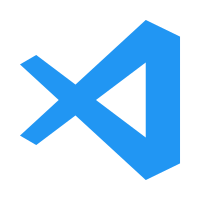

### Hi there, I'm Abdelmalek 👋

- 🎓 Master Student(Networking & Security) At Jijel University
- 👨‍💻 Computer Programming & DevOps
- 👨‍💻 Linux Expert
- 🔗 Connect me on [LinkedIn](https://www.linkedin.com/in/abdelmalek-rezig/)!

### Languages and Tools
[][python]
[][docker]
[][k8s]
[][ansible]
[][vscode]
[][github]
[][jenkins]
[][aws]
[][mysql]
[][redis]

[mygithub]:https://github.com/razig-ths
[python]:https://www.python.org/
[docker]:https://github.com/moby/moby
[k8s]:https://github.com/kubernetes/kubernetes
[ansible]:https://docs.ansible.com/
[vscode]:https://github.com/microsoft/vscode
[github]:https://github.com/
[aws]:https://docs.aws.amazon.com/
[jenkins]:https://www.jenkins.io/doc/
[mysql]:https://www.mysql.com/
[redis]:https://redis.io/

